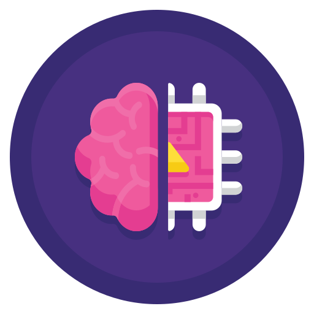

## Hey there 👋, I'm <a href="https://www.linkedin.com/in/hrithik-k-586967141/"> Hrithik Kumar Advani! </a>

I'm actively involved in building applications using LLM. I'm a dedicated practitioner and learner, deeply passionate about LLM Agents, LLMOps, and Natural Language Processing (NLP). I have always been struck by the ability to harness deep learning algorithms to tackle intricate problems and unearth valuable insights. I am here to solve things and learn a lot in the process.

<a href="https://twitter.com/AdvaniHrithik"></a>
<a href="https://www.linkedin.com/in/hrithik-k-586967141/"></a>
<br />

### Education
-  Honours Bachelor of Science (CS & STATS) at <a href="https://www.utoronto.ca/"> University of Toronto</a> <br />

### Current Position
-   Full Stack Java and GenAI Assistant Instructor at <a href="https://www.bptn.com/"> Obsidi by BPTN </a> 

### Previous Experience
-   Full Stack Website Development Assistant Instructor at <a href="https://www.bptn.com/"> Black Professionals In Tech Network (Bptn) Inc </a> <br />
-   Machine Learning Engineer at <a href="https://www.utoronto.ca/"> University of Toronto </a> <br />
-  Teaching Assistant at <a href="https://www.utoronto.ca/"> University of Toronto </a> <br />
-  Research Assistant at <a href="https://www.dsp.utoronto.ca/"> University of Toronto, Mississauga </a> <br />

###  A little more about me...  

```javascript
const Hrithik = {
  pronouns: "he" | "him",
  code: [Python, R, JAVA, Javascript, C, SQL],
  frameworks: [PyTorch, Tensorflow, Node.js, Django],
  expertise: ["Computer Vision", "Deep learning", "Natural Language Processing"],
  Platforms: {
                Python: ["VSCode", "Colab", "Jupyter Notebook"],
                SQL: "PostgreSQL",
                NoSQL: ["MongoDB", "Neo4j"]
                Cloud: ["AWS", "GCP"]
              },
 Current interests: "I am currently learning about efficiently deploying ML Models"
}
```
<br />

**Updates:**
- 🔭 I am currently pursuing a DevOps Post Graduate Diploma from Purdue University, in collaboration with Edureka
- 🔭 I completed a 4-month [DEZoomcamp2024](https://github.com/DataTalksClub/data-engineering-zoomcamp/tree/main/cohorts/2024) by [**DataTalks.Club**](https://datatalks.club/) 
- 🔭 I completed a 4-month [MLZoomcamp2023](https://github.com/alexeygrigorev/mlbookcamp-code/tree/master/course-zoomcamp) by [**DataTalks.Club**](https://datatalks.club/) 
- 👯 I’m looking to collaborate on **Data Science**, **Machine Learning** and **Deep Learning** projects


### 📊 My GitHub stats
<p>
<a href="https://github.com/Hrithik-Kumar">
  
  
</a>
</p>
 
<br />
📝 Check out my <a href="images/Resume.pdf"> resume </a> <br />


